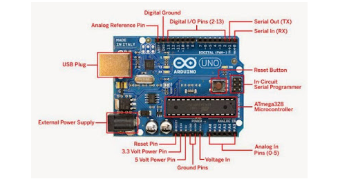
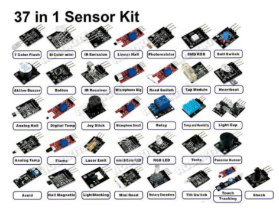

# Pertemuan 2

<h1>Pengertian Arduino</h1>

<ul>

  

  <li>Arduino adalah mikrokontroller / pengendali mikro papan tunggal(single board) yang bersifat sumber terbuka dan menjadi salah satu proyek Open Source Hardware yang paling populer. Dirancang untuk memudahkan penggunaan elektronik dalam berbagai bidang. </li>

  <li> Selain itu Perangkat kmponen penunjang Arduino sangatlah banyak, diantaranya perangkat sensor</li>

  
 

</ul>
