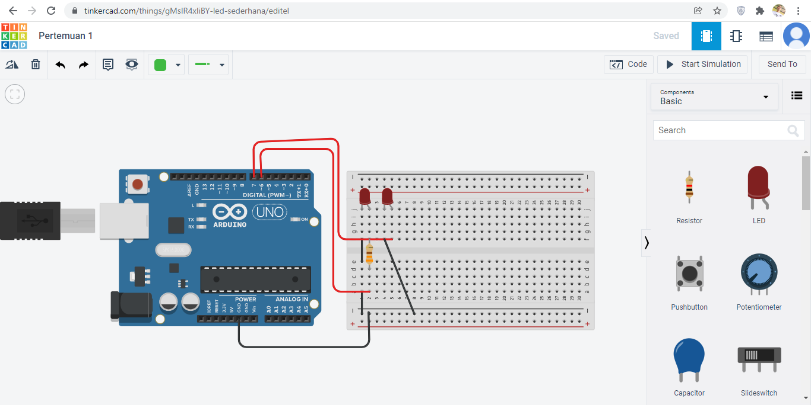
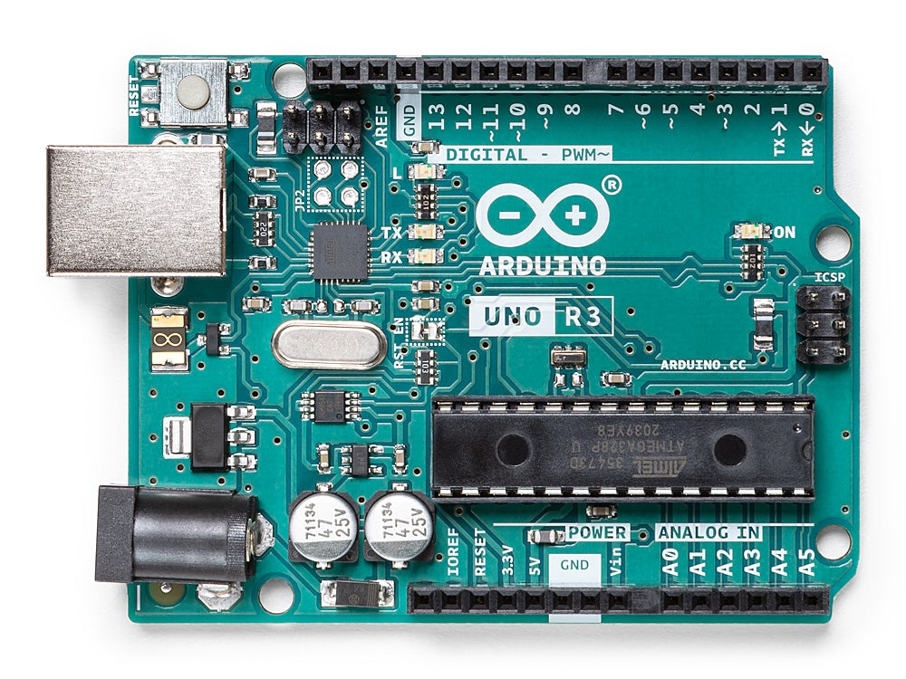

# Pertemuan 2

### Mengontrol led menggunakan arduino

<h3>Berikut adalah rangkaian led sederhana</h3>

 
<h3>Komponen-komponen yang terpasang</h3>
<ol>
	<li>Arduino <i><a href="#">(penjelasan di folder pertemuan 2)</a></i></li>
	<li>Breadboard</li>
	<li>Led dua kaki</li>
	
Kaki sebelah kiri merupakan <b>kathode</b>, yang mana tempat arus negatif mengalir, sedangkan sebelah kanan merupakan <b>anode</b>, tempat arus positif mengalir. Kedua kaki biasanya dapat dibedakan dengan perbedaan panjang kaki. Dengan bagian anode lebih panjang

	<li>Resistor</li>
	
Resistor atau hambatan ini merupakan komponen elektronika pasif yang memiliki fungsi guna
	<b>menghambat serta mengatur arus listrik di dalam suatu rangkaian elektronika.</b> Resistor atau hambatan ini juga
	memiliki satuan yang disebut dengan <b>Ohm</b>. Biasanya ukuran hambatan suatu resistor diwakili dengan kode angka maupun gelang warna
	yang ada pada badan resistor itu sendiri. Perlu diketahui bahwa hambatan resistor juga kerapkali disebut
	dengan resistansi atau resistance. Untuk led dengan ukuran 3mm/5mm biasanya hambatannya sebesar 220 ohm atau
	bisa juga 330 ohm

</ol>
 
<h3>Rangkaian</h3>
<ol>
	<li>Siapkan arduino uno dan breadboard, lalu ambil led dua kaki.</li>
	<li>Tanamkan led pada breadboard, cari posisi yang dekat dengan arduino.</li>
	<li>Koneksikan jalur yang menuju anode di breadboard, ke salah satu pin digital di arduino uno.</li>
	<li>Koneksikan jalur yang menuju kathode di breadboard dengan pin GND yang ada di arduino.</li>
	<li>Klik <i>start simulation</i></li>
	<li>Nyala lampu led dapat di manipulasi/dikontrol dengan kode melalui fitur <i>code</i>. Untuk lebih lengkapnya tonton video dibawah.</li>
</ol>
<h3>Untuk materi lebih detail, berikut video penjelasannya.</h3>
<i>Link pemutaran 1</i>
<iframe width="560" height="315" src="https://www.youtube.com/embed/95J__ZFfKoM?start=213" title="YouTube video player" frameborder="0" allow="accelerometer; autoplay; clipboard-write; encrypted-media; gyroscope; picture-in-picture" allowfullscreen></iframe>
  
<i>Link pemutaran 2</i>
<a href="https://youtu.be/95J__ZFfKoM">Pertemuan 1: Mengontrol led menggunakan arduino</a>

  

<h2>Arduino UNO Rev3</h2>

<blockquote>Arduino adalah mikrokontroller / pengendali mikro papan tunggal(single board) yang bersifat sumber terbuka dan menjadi salah satu proyek Open Source Hardware yang paling populer. Dirancang untuk memudahkan penggunaan elektronik dalam berbagai bidang.</blockquote>

<figure>
	
</figure>

<h3>Definisi</h3>

Arduino Uno adalah board mikrokontroler yang berbasis ATmega328P (datasheet). Ini memiliki 14 pin input/output digital (6 di antaranya dapat digunakan sebagai output PWM), 6 input analog, resonator keramik 16 MHz (CSTCE16M0V53-R0), koneksi USB, colokan listrik, header ICSP, dan tombol reset . Ini berisi semua yang diperlukan untuk mendukung mikrokontroler; cukup sambungkan ke komputer dengan kabel USB atau nyalakan dengan adaptor AC-ke-DC atau baterai untuk memulai.. Anda dapat mengotak-atik Uno Anda tanpa terlalu khawatir melakukan sesuatu yang salah, skenario terburuk Anda dapat menggantinya chip untuk beberapa dolar dan mulai dari awal lagi.

<h3>Diagram pin</h3>
<figure>
	
</figure>

<h4>Spesifikasi Teknik</h4>
<table>
	<tr>
		<td>MICROCONTROLLER</td>
		<td>ATmega328T</td>
	</tr>
	<tr>
		<td>OPERATING VOLTAGE</td>
		<td>5V</td>
	</tr>
	<tr>
		<td>INPUT VOLTAGE (RECOMENDED)</td>
		<td>7 - 12V</td>
	</tr>
	<tr>
		<td>INPUT VOLTAGE (LIMIT)</td>
		<td>6 - 20V</td>
	</tr>
	<tr>
		<td>DIGITAL I/O PINS</td>
		<td>14 (Beberapa sebagai PWM output)</td>
	</tr>
	<tr>
		<td>PWM DIGITAL I/O PINS</td>
		<td>6</td>
	</tr>
	<tr>
		<td>ANALOG INPUT PINS</td>
		<td>6</td>
	</tr>
	<tr>
		<td>DC CURRENT PER I/O PIN</td>
		<td>20mA</td>
	</tr>
	<tr>
		<td>DC CURRENT FOR 3.3V PIN</td>
		<td>50mA</td>
	</tr>
	<tr>
		<td>FLASH MEMORY</td>
		<td>32 KB (ATmega328P) of which 0.5 KB used by bootloader</td>
	</tr>
	<tr>
		<td>SRAM</td>
		<td>2 KB (ATmega328P</td>
	</tr>
	<tr>
		<td>EEPROM</td>
		<td>1 KB (ATmega328P)</td>
	</tr>
	<tr>
		<td>CLOCK SPEED</td>
		<td>1 KB (ATmega328P)</td>
	</tr>
	<tr>
		<td>LED BUILTIN</td>
		<td>16 MHz</td>
	</tr>
	<tr>
		<td>LENGTH</td>
		<td>68.6 mm</td>
	</tr>
	<tr>
		<td>WIDTH</td>
		<td>53.4 mm</td>
	</tr>
	<tr>
		<td>WEIGHT</td>
		<td>25 gr</td>
	</tr>

</table>

Source: https://store.arduino.cc/products/arduino-uno-rev3/
