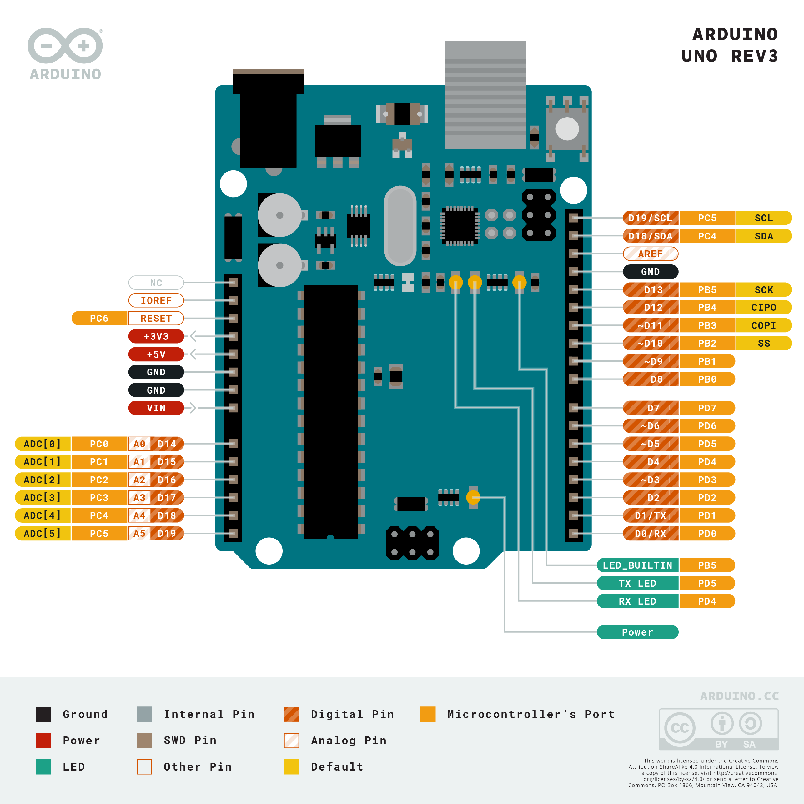

# Pertemuan 2

<h2>Arduino UNO Rev3</h2>

<blockquote>Arduino adalah mikrokontroller / pengendali mikro papan tunggal(single board) yang bersifat sumber terbuka dan menjadi salah satu proyek Open Source Hardware yang paling populer. Dirancang untuk memudahkan penggunaan elektronik dalam berbagai bidang.</blockquote>

<figure>
	
</figure>

<h3>Definisi</h3>

Arduino Uno adalah board mikrokontroler yang berbasis ATmega328P (datasheet). Ini memiliki 14 pin input/output digital (6 di antaranya dapat digunakan sebagai output PWM), 6 input analog, resonator keramik 16 MHz (CSTCE16M0V53-R0), koneksi USB, colokan listrik, header ICSP, dan tombol reset . Ini berisi semua yang diperlukan untuk mendukung mikrokontroler; cukup sambungkan ke komputer dengan kabel USB atau nyalakan dengan adaptor AC-ke-DC atau baterai untuk memulai.. Anda dapat mengotak-atik Uno Anda tanpa terlalu khawatir melakukan sesuatu yang salah, skenario terburuk Anda dapat menggantinya chip untuk beberapa dolar dan mulai dari awal lagi.

<h3>Diagram pin</h3>
<figure>
	
</figure>

<h4>Spesifikasi Teknik</h4>
<table>
	<tr>
		<td>MICROCONTROLLER</td>
		<td>ATmega328T</td>
	</tr>
	<tr>
		<td>OPERATING VOLTAGE</td>
		<td>5V</td>
	</tr>
	<tr>
		<td>INPUT VOLTAGE (RECOMENDED)</td>
		<td>7 - 12V</td>
	</tr>
	<tr>
		<td>INPUT VOLTAGE (LIMIT)</td>
		<td>6 - 20V</td>
	</tr>
	<tr>
		<td>DIGITAL I/O PINS</td>
		<td>14 (Beberapa sebagai PWM output)</td>
	</tr>
	<tr>
		<td>PWM DIGITAL I/O PINS</td>
		<td>6</td>
	</tr>
	<tr>
		<td>ANALOG INPUT PINS</td>
		<td>6</td>
	</tr>
	<tr>
		<td>DC CURRENT PER I/O PIN</td>
		<td>20mA</td>
	</tr>
	<tr>
		<td>DC CURRENT FOR 3.3V PIN</td>
		<td>50mA</td>
	</tr>
	<tr>
		<td>FLASH MEMORY</td>
		<td>32 KB (ATmega328P) of which 0.5 KB used by bootloader</td>
	</tr>
	<tr>
		<td>SRAM</td>
		<td>2 KB (ATmega328P</td>
	</tr>
	<tr>
		<td>EEPROM</td>
		<td>1 KB (ATmega328P)</td>
	</tr>
	<tr>
		<td>CLOCK SPEED</td>
		<td>1 KB (ATmega328P)</td>
	</tr>
	<tr>
		<td>LED BUILTIN</td>
		<td>16 MHz</td>
	</tr>
	<tr>
		<td>LENGTH</td>
		<td>68.6 mm</td>
	</tr>
	<tr>
		<td>WIDTH</td>
		<td>53.4 mm</td>
	</tr>
	<tr>
		<td>WEIGHT</td>
		<td>25 gr</td>
	</tr>

</table>

Source: https://store.arduino.cc/products/arduino-uno-rev3/
