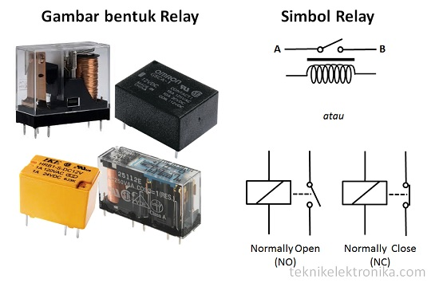

# Pertemuan 3

<h1>Tinkercad relay + lampu</h1>

### Prinsip Kerja Relay

Pada dasarnya, Relay terdiri dari 4 komponen dasar  yaitu :

<ul>
	<li>Electromagnet (Coil)</li>
	<li>Armature</li>
	<li>Switch Contact Point (Saklar)</li>
	<li>Spring</li>
</ul>

Berikut ini merupakan gambar dari bagian-bagian Relay :

Kontak Poin (Contact Point) Relay terdiri dari 2 jenis yaitu :

<ul>
	<li>Normally Close (NC) yaitu kondisi awal sebelum diaktifkan akan selalu berada di posisi CLOSE (tertutup)</li>
	<li>Normally Open (NO) yaitu kondisi awal sebelum diaktifkan akan selalu berada di posisi OPEN (terbuka)</li>
</ul>

Referensi :

<a href="https://teknikelektronika.com/pengertian-relay-fungsi-relay/">teknikelektronika.com/pengertian-relay-fungsi-relay</a>