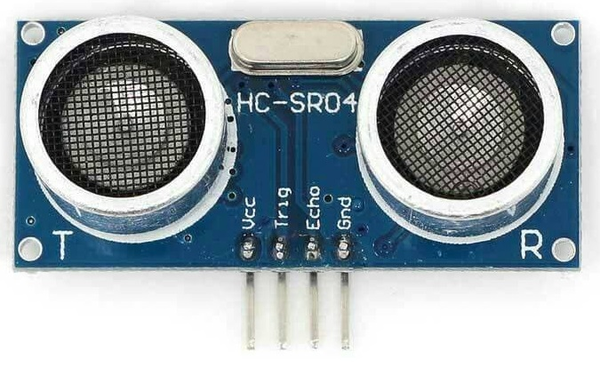
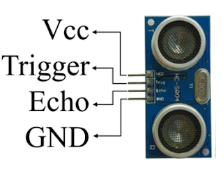
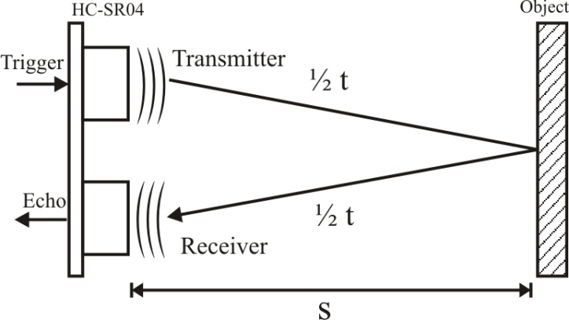
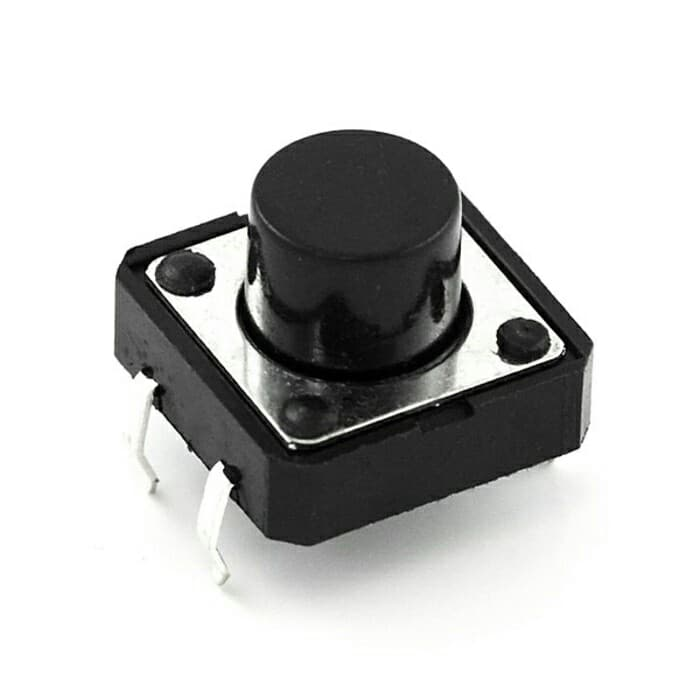
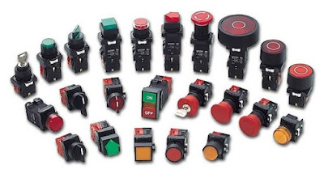

# Pertemuan 4

## Sensor Ultrasonik + Button

### Sensor HC-SR04

<h3><u><b>Definisi</b></u></h3>
<blockquote>HC-SR04 adalah sebuah modul sensor ultrasonik yang biasanya digunakan untuk alat pengukur jarak.
</blockquote>
 

Pada HC-SR04 terdapat sepasang transducer ultrasonik yang satu berfungsi sebagai transmitter yang bertugas untuk mengubah sinyal elektrik menjadi sinyal pulsa gelombang suara ultrasonik dengan frekuensi 40KHz, dan satunya berfungsi sebagai receiver yang bertugas untuk menerima sinyal gelombang suara ultrasonik.

<figure>
	
	<figcaption style="text-align: center;">
Gambar fisik Sensor HC-SR04
</figcaption>
</figure>

Apa itu gelombang ultrasonik? Gelombang suara ultrasonik adalah sebuah gelombang suara dengan frekuensi yang berada diatas batas pendengaran manusia. Seperti yang kita ketahui bahwasannya batas pendengaran manusia berada pada rentang frekuensi 20Hz – 20KHz.

 
<h3><u><b>Pin dan Fungsinya</b></u></h3>

<ol>
	<li>VCC = 5V Power Supply. Pin sumber tegangan positif sensor.</li>
	<li>Trig = Trigger/Penyulut. Pin ini yang digunakan untuk membangkitkan sinyal ultrasonik.</li>
	<li>Echo = Receive/Indikator. Pin ini yang digunakan untuk mendeteksi sinyal pantulan ultrasonik.</li>
	<li>GND = Ground/0V Power Supply. Pin sumber tegangan negatif sensor.</li>
</ol>
 
<h3><u><b>Cara Kerja</b></u></h3>

Sebuah sinyal pulsa dengan durasi setidaknya 10 μS (10 mikrodetik) diterapkan ke pin Trigger. Setelah itu, sensor mentransmisikan gelombang ultrasonik delapan pulsa pada frekuensi 40 KHz. Pola 8-pulsa ini digunakan untuk sebuah penanda sinyal ultrasonik dari modul ini, yang memungkinkan receiver / penerima untuk membedakan pola yang ditransmisikan dari kebisingan ultrasonik sekitar.

Delapan pulsa ultrasonik bergerak melalui udara menjauh dari transmitter / pemancar mengarah ke benda atau obyek yang ada di depannya. Sementara itu pin Echo menjadi HIGH / TINGGI untuk mulai membentuk awal sinyal gema.

Jika tidak ada sinyal ultrasonik yang dipantulkan atau diterima oleh receiver selama rentang 38 mS (mili detik), yang artinya tidak ada obyek atau benda maka sinyal Echo akan Timeout dan kembali menjadi LOW / RENDAH.

Sedangkan jika ada sinyal ultrasonik yang dipantulkan atau diterima oleh receiver, maka saat itu juga sinyal Echo langsung berubah menjadi LOW / RENDAH. Nah, lebar rentang waktu dari sinyal ECHO inilah yang digunakan untuk mengukur jarak antara sensor dengan obyek atau benda.

Dengan menggunakan persamaan jarak – kecepatan – waktu dari gelombang suara yang merambat pada udara, maka bisa dijabarkan sebagai berikut :

<ul>
	<li>Jarak = Kecepatan x Waktu.</li>
	
Dimana kecepatan gelombang suara pada udara adalah = 340 m/s = 0.034 cm/μS. Karena jarak tempuh gelombang suara ultrasonik tadi adalah bolak-balik yaitu dari sensor (transmitter) ke obyek dan kembali ke sensor (receiver), maka rumusnya menjadi :

	<li>Jarak (cm) = Waktu (μS) * 0.034 / 2</li>
	

</ul>
 
 

<h2>Push Button</h2>
 
<h3><u><b>Definisi</b></u></h3>
<blockquote>Push button (juga dieja tombol tekan) atau tombol sederhana adalah mekanisme sakelar sederhana untuk mengontrol beberapa aspek mesin atau proses. Dimana dengan memutus dan mengalirkan arus listrik dalam suatu rangkaian</blockquote>

 
<h3><u><b>Konstruksi</b></u></h3>

Push button switch adalah mekanisme kecil tertutup yang melengkapi sirkuit listrik saat ditekan. Saat menyala, pegas logam kecil di dalamnya membuat kontak dengan dua kabel, memungkinkan listrik mengalir. Saat dimatikan, pegas memendek, kontak terputus, dan arus tidak akan mengalir. Tubuh sakelar terbuat dari plastik non-konduktor.

 
<h3><u><b>Fungsi</b></u></h3>

Seperti yang dijelaskan pada poin sebelumnya, bahwa fungsi push button adalah untuk memutus dan menyambungkan arus listrik. Biasanya push button ini digunakan untuk memicu jalannya suatu perangkat output seperti relay, buzzer, LED, maupun yang lainnya.

 
<h3><u><b>Cara kerja</b></u></h3>
<ul>
	<li>Momentary Contact</li>
	
Sakelar sesaat hanya berfungsi selama Anda menekannya, seperti tombol pada telepon, kalkulator, atau bel pintu. Mereka dapat dibagi lagi menjadi tipe normal-on dan biasanya-mati.

	<ul>
		<li>Normally-Off</li>
		
Dengan sakelar yang biasanya mati, tidak ada koneksi sampai Anda menekan tombol. Sebagian besar sakelar tombol tekan digunakan dengan cara ini. Contohnya termasuk tombol bel pintu, kunci ponsel dan pembuka pintu garasi.

		<li>Normali-On</li>
		
Di sini sakelar berfungsi secara normal, tetapi memutus sirkuit saat Anda menekannya. Ini lebih khusus, dan dapat digunakan bersama dengan trik pengkabelan. Misalnya, menghubungkan sakelar yang biasanya aktif secara paralel dengan bola lampu akan menyalakan bola lampu saat tombol ditekan; jika tidak, arus akan mengalir melalui sakelar, membiarkan bohlam mati.

	</ul>
	<li>Non-Momentary Contact</li>
	
Sakelar non-sementara mengambil satu dorongan untuk menghidupkan, yang lain untuk mematikan. TV dan stereo menggunakan sakelar non-sementara untuk tombol dayanya.

	
Sehingga pada saat ditekan, ia akan memutus arus listrik. Serta kembali ke posisi semua apabila dilepas.

</ul>
 
<h3><u><b>Jenis</b></u></h3>

<ol>
	<li>Push Button NO (Normally Open)</li>
	
Jenis push button ini akan menyambungkan arus listrik saat ditekan, dan akan kembali seperti semula saat dilepas. Fungsi push button NO biasanya untuk membuat tombol mulai atau start.

	<li>Push Button NC (Normally Close)</li>
	
Fungsi push button NC adalah kebalikan dari NO dan sering disebut sebagai tombol emergency atau stop. Dalam kondisi awal, ia bersifat mengalirkan arus listrik.

	<li>Push Button Perpaduan NO dan NC</li>
	
Untuk jenis yang satu ini memiliki empat kaki terminal kontak. Dimana pada saat tombol ditekan, maka sepasang terminal kontaknya akan berada dalam NC, sedangkan dua lainnya NO. Sehingga apabila push button ditekan lagi untuk yang kedua kalinya, maka akan terjadi sebaliknya. Sampai sini kamu sudah paham kan fungsi push button NO dan NC.

</ol>

 

Sensor HC-SR04 dan Push Button dengan Arduino:

<a href="https://youtu.be/FuVUWniBEfI">Lihat Video Pertemuan-4 Materi ke-3</a>

 
 

Referensi:
 
<a href="https://www.nn-digital.com/blog/2019/07/31/cara-kerja-sensor-hc-sr04-dan-contoh-program-dengan-arduino/">www.nn-digital.com/blog/2019/07/31/cara-kerja-sensor-hc-sr04-dan-contoh-program-dengan-arduino/</a>
 
<a href="https://www.andalanelektro.id/2018/09/cara-kerja-dan-karakteristik-sensor-ultrasonic-hcsr04.html">www.andalanelektro.id/2018/09/cara-kerja-dan-karakteristik-sensor-ultrasonic-hcsr04.html</a>
 
<a href="https://www.aldyrazor.com/2020/05/push-button-arduino.html">www.aldyrazor.com/2020/05/push-button-arduino.html</a>
 
<a href="https://sciencing.com/electric-relay-5124901.html">www.sciencing.com/electric-relay-5124901.html</a>
 