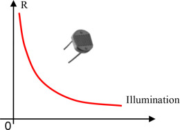

# Pertemuan 4

### Sensor LDR & Relay + Lampu

### PHOTORESISTOR (LDR)

<i>Fotoresistor, perangkat yang resistansinya berubah dengan cahaya sekitar, sel surya yang daya keluarannya sebanding dengan cahaya sekitar, fotodioda yang arus keluarannya sebanding dengan cahaya dan thermopiles yang mengubah cahaya menjadi suhu menjadi tegangan.
</i>
 

Fotoresistor, juga dikenal sebagai LDR (resistor tergantung cahaya), adalah komponen yang terbuat dari semikonduktor. Sebuah fotoresistor sensitif terhadap cahaya. Resistansinya berkurang saat pencahayaan meningkat (Gambar 1.15). Fotoresistor memiliki banyak kegunaan, misalnya, pembukaan pintu otomatis.

Variasi resistansi LDR sebagai fungsi penerangan
