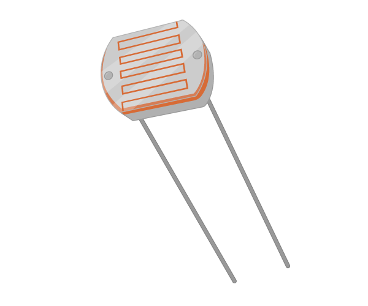
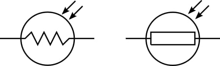
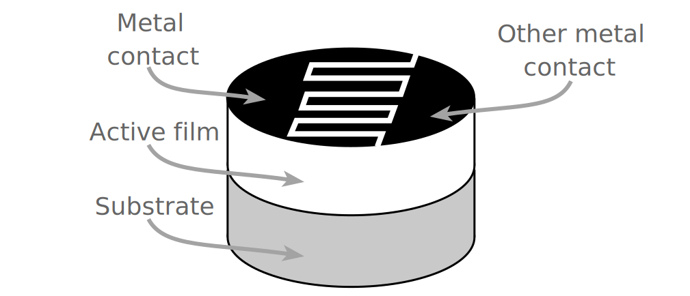
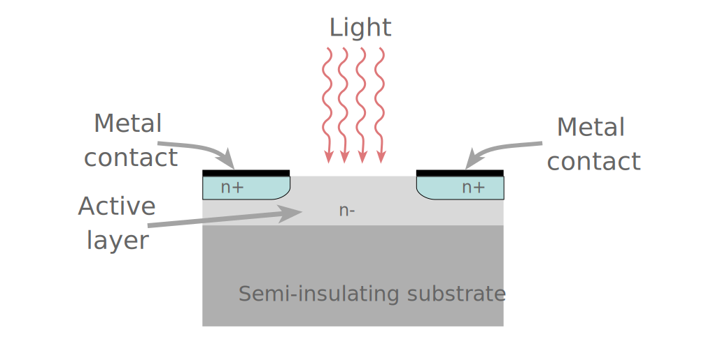
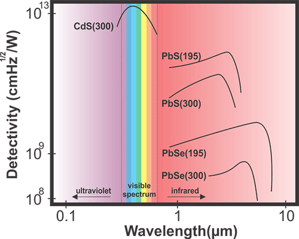

# Pertemuan 4

### Sensor LDR & Relay + Lampu

### PHOTORESISTOR (LDR)

<u><b>Definisi</b></u>
<blockquote>Photoresistor adalah resistor peka cahaya yang resistansinya berkurang seiring dengan meningkatnya intensitas cahaya.
</blockquote>
 

Photoresistor, juga dikenal sebagai LDR (Light Dependant Resistor) adalah perangkat peka cahaya yang paling sering digunakan untuk menunjukkan ada tidaknya cahaya, atau untuk mengukur intensitas cahaya. Dalam gelap, resistansinya sangat tinggi, terkadang hingga 1 MΩ, tetapi ketika sensor LDR terkena cahaya, resistansinya turun drastis, bahkan hingga beberapa ohm, tergantung pada intensitas cahaya. LDR memiliki sensitivitas yang bervariasi dengan panjang gelombang cahaya yang diterapkan dan merupakan perangkat nonlinier.

<figure>
	
	<figcaption style="text-align: center;">
Gambar fisik Photoresistor/LDR
</figcaption>
</figure> 

<u><b>Simbol</b></u>
<figure>
	
</figure>

<u><b>Struktur LDR</b></u>
<figure>
	
	
</figure>

<u><b>Tipe berdasarkan materialnya</b></u>
<ol>
	<li><b>Intrinsik</b></li>
	
Ini terbuat dari bahan semikonduktor murni seperti silikon atau germanium. Elektron tereksitasi ke pita konduksi dari pita valensi ketika foton dengan energi yang cukup jatuh di atasnya dan jumlah pembawa muatan dinaikkan.

	<li><b>Ekstrinsik</b></li>
	
Ini adalah bahan semikonduktor yang didoping dengan kontaminan yang disebut dopan. Dopan ini menghasilkan pita energi baru di atas pita valensi yang diisi dengan elektron. Oleh karena itu ini mengurangi celah pita. Sehingga lebih sedikit energi yang dibutuhkan dalam menggairahkan mereka. Resistor foto ekstrinsik biasanya digunakan untuk panjang gelombang tinggi.

</ol>

<u><b>Ketergantungan panjang gelombang</b></u>
<figure>
	
	<figcaption>
Sensitivitas LDR bervariasi dengan panjang gelombang cahaya. Jika panjang gelombang berada di luar kisaran tertentu, itu tidak akan mempengaruhi resistansi perangkat sama sekali. Dapat dikatakan bahwa LDR tidak sensitif pada rentang panjang gelombang cahaya tersebut. Bahan yang berbeda memiliki kurva respons spektral unik yang berbeda dari panjang gelombang versus sensitivitas.
</figcaption>
</figure>

<u><b>Penerapan/Aplikasi</b></u>

LDR memiliki biaya rendah dan sering digunakan sebagai sensor cahaya. Aplikasi lain dari resistor foto meliputi:

<ul>
	<li>Mengklasifikasikan ketersediaan atau ketidaktersediaan cahaya seperti pada light meter kamera.</li>
	<li>Digunakan dalam desain penerangan jalan (dapat digabungkan dengan starter kit Arduino yang baik untuk bertindak sebagai pengontrol lampu jalan)</li>
	<li>Digunakan dalam jam alarm</li>
	<li>Digunakan di sirkuit alarm pembobol rumah</li>
	<li>Digunakan dalam pengukur intensitas cahaya</li>
	<li>Digunakan sebagai bagian dari sistem SCADA untuk mengimplementasikan tujuan seperti menghitung jumlah paket pada ban berjalan yang bergerak, dll.</li>
</ul>

 
 
<i>source1: https://eepower.com/resistor-guide/resistor-types/photo-resistor/#</i> 
<i>source2: https://engineeringlearn.com/what-is-ldr-photoresistor-types-working-application-diagram-symbol-complete-details/</i> 
<i>source3: https://www.electronics-notes.com/articles/electronic_components/resistors/light-dependent-resistor-ldr.php</i>