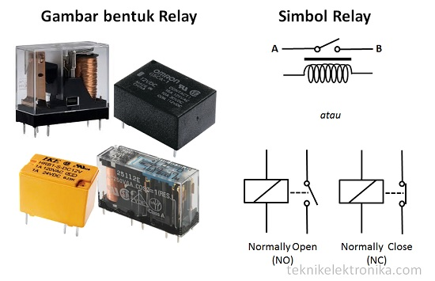

# Pertemuan 5

<h1>Tinkercad relay + lampu</h1>

## Prinsip Kerja Relay

Apa itu relay?

Relay adalah sakelar listrik yang menggunakan elektromagnetisme untuk mengubah rangsangan listrik kecil menjadi arus yang lebih besar.

 

Pada dasarnya, Relay terdiri dari 4 komponen dasar  yaitu :

<ul>
	<li>Electromagnet (Coil)</li>
	<li>Armature</li>
	<li>Switch Contact Point (Saklar)</li>
	<li>Spring</li>
</ul>

Berikut ini merupakan gambar dari bagian-bagian Relay :

Kontak Poin (Contact Point) Relay terdiri dari 2 jenis yaitu :

<ul>
	<li>Normally Close (NC) yaitu kondisi awal sebelum diaktifkan akan selalu berada di posisi CLOSE (tertutup)</li>
	<li>Normally Open (NO) yaitu kondisi awal sebelum diaktifkan akan selalu berada di posisi OPEN (terbuka)</li>
</ul>

Berdasarkan gambar diatas, sebuah Besi (Iron Core) yang dililit oleh sebuah kumparan Coil yang berfungsi untuk mengendalikan Besi tersebut. Apabila Kumparan Coil diberikan arus listrik, maka akan timbul gaya Elektromagnet yang kemudian menarik Armature untuk berpindah dari Posisi sebelumnya (NC) ke posisi baru (NO) sehingga menjadi Saklar yang dapat menghantarkan arus listrik di posisi barunya (NO). Posisi dimana Armature tersebut berada sebelumnya (NC) akan menjadi OPEN atau tidak terhubung. Pada saat tidak dialiri arus listrik, Armature akan kembali lagi ke posisi Awal (NC). Coil yang digunakan oleh Relay untuk menarik Contact Poin ke Posisi Close pada umumnya hanya membutuhkan arus listrik yang relatif kecil.

<h3>Arti Pole dan Throw pada Relay</h3>

Karena Relay merupakan salah satu jenis dari Saklar, maka istilah Pole dan Throw yang dipakai dalam Saklar juga berlaku pada Relay. Berikut ini adalah penjelasan singkat mengenai Istilah Pole and Throw :

<ul>
	<li><b>Pole :</b> Banyaknya Kontak (Contact) yang dimiliki oleh sebuah relay</li>
	<li><b>Throw :</b> Banyaknya kondisi yang dimiliki oleh sebuah Kontak (Contact)</li>
</ul>

Berdasarkan penggolongan jumlah Pole dan Throw-nya sebuah relay, maka relay dapat digolongkan menjadi :

<ul>
	<li>Single Pole Single Throw (SPST) : Relay golongan ini memiliki 4 Terminal, 2 Terminal untuk Saklar dan 2 Terminalnya lagi untuk Coil.</li>
	<li>Single Pole Double Throw (SPDT) : Relay golongan ini memiliki 5 Terminal, 3 Terminal untuk Saklar dan 2 Terminalnya lagi untuk Coil.</li>
	<li>Double Pole Single Throw (DPST) : Relay golongan ini memiliki 6 Terminal, diantaranya 4 Terminal yang terdiri dari 2 Pasang Terminal Saklar sedangkan 2 Terminal lainnya untuk Coil. Relay DPST dapat dijadikan 2 Saklar yang dikendalikan oleh 1 Coil.</li>
	<li>Double Pole Double Throw (DPDT) : Relay golongan ini memiliki Terminal sebanyak 8 Terminal, diantaranya 6 Terminal yang merupakan 2 pasang Relay SPDT yang dikendalikan oleh 1 (single) Coil. Sedangkan 2 Terminal lainnya untuk Coil.</li>
</ul>

Selain Golongan Relay diatas, terdapat juga Relay-relay yang Pole dan Throw-nya melebihi dari 2 (dua). Misalnya 3PDT (Triple Pole Double Throw) ataupun 4PDT (Four Pole Double Throw) dan lain sebagainya.

Untuk lebih jelas mengenai Penggolongan Relay berdasarkan Jumlah Pole dan Throw, silakan lihat gambar dibawah ini :

<h3>Fungsi-fungsi dan Aplikasi Relay</h3>

Beberapa fungsi Relay yang telah umum diaplikasikan kedalam peralatan Elektronika diantaranya adalah :

<ul>
	<li>Relay digunakan untuk menjalankan Fungsi Logika (Logic Function)</li>
	<li>Relay digunakan untuk memberikan Fungsi penundaan waktu (Time Delay Function)</li>
	<li>Relay digunakan untuk mengendalikan Sirkuit Tegangan tinggi dengan bantuan dari Signal Tegangan rendah.</li>
	<li>Ada juga Relay yang berfungsi untuk melindungi Motor ataupun komponen lainnya dari kelebihan Tegangan ataupun hubung singkat (Short).</li>
</ul>

<h3>Rangkaian relay dan cara kerjanya</h3>

Di bawah ini merupakan contoh rangkaian relay yang menggunakan satu buah transistor sebagai drivernya. Transistor yang digunakan bisa dari jenis NPN maupun PNP. Anda tinggal menyesuaikan pemberian bias tegangannya saja.

<ul>
	<li>Saat basis transistor tidak menerima bias tegangan, maka transistor dalam kondisi Off</li>
	<li>Hambatan pada kolektor – emitor transistor sangat besar. Transistor berperilaku seperti saklar terbuka</li>
	<li>Arus listrik dari Vcc tidak dapat mengalir melewati kumparan relay</li>
	<li>Ketika basis transistor diberikan tegangan bias, maka transistor akan mulai aktif</li>
	<li>Hambatan pada kolektor – emitor transistor menjadi sangat kecil sehingga memungkinkan dilewati oleh arus listrik</li>
	<li>Arus listrik Vcc mengalir melewati kumparan relay dan kolektor – emitor</li>
	<li>Karena kumparan mendapatkan arus listrik, maka akan muncul medan magnet yang akan menarik tuas switch</li>
	<li>Relay akan kembali Off jika tegangan bias basis transistor diputuskan</li>
</ul>

Besar tegangan bias yang dibutuhkan oleh basis transistor cukup keci, sekitar 2V sampai 5V saja. Dengan tegangan bias sekecil itu, transistor dapat menggerakkan relay untuk mengalirkan tegangan yang jauh lebih besar.

Transistor yang digunakan untuk membuat rangkaian relay dapat disesuaikan dengan kapasitas relay yang akan dipakai. Rangkaian diatas dapat difungsikan untuk mengendalikan lampu maupun motor listrik.

<h2>Transistor</h2>

<h3>Definisi</h3>

Transistor adalah komponen semikonduktor yang memiliki berbagai macam fungsi seperti sebagai penguat, pengendali, penyearah, osilator, modulator dan lain sebagainya.

 
<h3>Jenis-jenis Transistor</h3>

Secara umum, Transistor dapat digolongkan menjadi dua keluarga besar yaitu Transistor Bipolar dan Transistor Efek Medan (Field Effect Transistor). Perbedaan yang paling utama diantara dua pengelompokkan tersebut adalah terletak pada bias Input (atau Output) yang digunakannya. Transistor Bipolar memerlukan arus (current) untuk mengendalikan terminal lainnya sedangkan Field Effect Transistor (FET) hanya menggunakan tegangan saja (tidak memerlukan arus). Pada pengoperasiannya, Transistor Bipolar memerlukan muatan pembawa (carrier) hole dan electron sedangkan FET hanya memerlukan salah satunya.

<ol>
	<li>Transistor Bipolar (BJT)</li>
	
Transistor Bipolar adalah Transistor yang struktur dan prinsip kerjanya memerlukan perpindahan muatan pembawanya yaitu electron di kutup negatif untuk mengisi kekurangan electon atau hole di kutub positif.   Bipolar berasal dari kata “bi” yang artinya adalah “dua” dan kata “polar” yang artinya adalah “kutub”. Transistor Bipolar juga sering disebut juga dengan singkatan BJT yang kepanjangannya adalah Bipolar Junction Transistor.

	
Jenis-jenis transistor bipolar

	
	<ul>
		<li><b>Transistor NPN</b> adalah transistor bipolar yang menggunakan arus listrik kecil dan tegangan positif pada terminal Basis untuk mengendalikan aliran arus dan tegangan yang lebih besar dari Kolektor ke Emitor.</li>
		<li><b>Transistor PNP</b> adalah transistor bipolar yang menggunakan arus listrik kecil dan tegangan negatif pada terminal Basis untuk mengendalikan aliran arus dan tegangan yang lebih besar dari Emitor ke Kolektor.</li>
	</ul>
	<li>Transistor Efek Medan (FET:Field Effect Transistor)</li>
	<ul>
		<li><b>JFET (Junction Field Effect Transistor)</b> adalah Transistor Efek Medanyang menggunakan persimpangan (junction) p-n bias terbalik sebagai isolator antara Gerbang (Gate) dan Kanalnya. JFET terdiri dari dua jenis yaitu JFET Kanal P (p-channel) dan JFET Kanal N (n-channel). JFET terdiri dari tiga kaki terminal yang masing-masing terminal tersebut diberi nama Gate (G), Drain (D) dan Source (S).</li>
		<li><b>MOSFET (Metal Oxide Semiconductor Field Effect Transistor)</b> adalah Transistor Efek Medan yang menggunakan Isolator (biasanya menggunakan Silicon Dioksida atau SiO2) diantara Gerbang (Gate) dan Kanalnya. MOSFET ini juga terdiri dua jenis konfigurasi yaitu MOSFET Depletion dan MOSFET Enhancement yang masing-masing jenis MOSFET ini juga terbagi menjadi MOSFET Kanal-P (P-channel) dan MOSFET Kanal-N (N-channel). MOSFET terdiri dari tiga kaki terminal yaitu Gate (G), Drain (D) dan Source (S).</li>
		<li><b>UJT (Uni Junction Transistor)</b> adalah jenis Transistor yang digolongkan sebagai Field Effect Transistor (FET) karena pengoperasiannya juga menggunakan medan listrik atau tegangan sebagai pengendalinya. Berbeda dengan jenis FET lainnya, UJT mememiliki dua terminal Basis (B1 dan B2) dan 1 terminal Emitor. UJT digunakan khusus sebagai pengendali (switch) dan tidak dapat dipergunakan sebagai penguat seperti jenis transistor lainnya.</li>
	</ul>
</ol>
 
<h3>Cara Kerja</h3>
Transistor merupakan  perangkat  non-linear sehingga memiliki cara kerja dalam 4 mode yang berbeda.
<ul>
	<li>Cut-off. Transistor bekerja sebagai open circuit, sehingga tidak terdapat arus yang mengalir ke emitor ke kolektor. </li>
	<li>Saturasi. Transistor bertindak sebagai short circuit,  yang membuat arus dari kolektor ke emitor mengalir bebas. </li>
	<li>Active. Arus yang berbanding lurus dengan arus yang mengalir ke basis merupakan arus dari kolektor ke emitor.</li>
	<li>Reverse active.  Berbanding terbalik dengan mode sebelumnya, arus mengalir terbalik dari emitor ke kolektor. </li>
</ul>

secara umum transistor dibedakan menjadi dua yaitu bipolar dan JFET atau Junction FET. Cara kerja dari kedua transistor ini juga berbeda.

<ol>
	<li><b>Cara Kerja Transistor Bipolar</b></li>
	
Transistor bipolar merupakan salah satu jenis transistor yang paling populer sehingga banyak digunakan. Transistor bipolar ini terdiri dari 3 kaki yaitu emitor, basis dan kolektor. Pada kaki tersebut terdapat tegangan penghalang sekitar 0,5 hingga 0,7 V yang berarti dibutuhkan tegangan listrik paling minimal 0,5 hingga 0,7  untuk dapat membuat arus listrik mengalir melalui kaki transistor bipolar.

	
Cara kerja dari transistor bipolar yaitu dengan membuat komponen aktif dan tiga terminal yang terbuat dari  bahan semikonduktor dapat bertindak sebagai isolator dan konduktor. Cara kerja inilah yang membuat transistor bipolar sering digunakan untuk saklar atau penguat. 

	<li><b>Cara Kerja Transistor JFET</b></li>
	
Transistor JFET atau junction field effect transistor merupakan transistor yang menggunakan tegangan pada terminal inputnya. Hal seperti ini dalam dunia rangkaian elektronika dikenal dengan istilah gerbang. Gerbang ini akan menghasilkan arus keluaran yang sebanding dengan mengendalikan arus yang akan mengalir melalui kaki terminal komponen. Hal inilah yang membuat transistor JFET dikenal juga  dengan  transistor yang dapat mengatur tegangan. 

	
Sama halnya dengan transistor bipolar, transistor JFET juga memiliki tiga kaki terminal yang terbuat dari bahan semikonduktor. Akan tetapi, ketiga memiliki nama yang berbeda yaitu gate, source dan drain. Selain itu, ketiga terminal tersebut juga memiliki karakteristik yang unik yang dapat mengalirkan arus ke daerah drain dan source. Akan tetapi,  arus yang dialirkan tersebut dikendalikan  oleh tegangan tertentu yang diberikan kepada gate.

</ol>

<h2>Diode</h2>
<h3>Definisi</h3>
 

Dioda (diode) adalah komponen elektronika aktif yang terbuat dari bahan semikonduktor dan mempunyai fungsi untuk menghantarkan arus listrik ke satu arah tetapi menghambat arus listrik dari arah sebaliknya.

Dalam ilmu fisika dioda digunakan untuk penyeimbang arah rangkaian elektronika. Elektronika memiliki dua terminal yaitu anoda berarti positif dan katoda berarti negatif. Prinsip kerja dari anode berdasarkan teknologi pertemuan positif dan negative semikonduktor. Sehingga anode dapat menghantarkan arus litrik dari anoda menuju katoda, tetapi tika sebaliknya katoda ke anoda.

<h3>Fungsi Dioda</h3>
<ul>
	<li>Untuk alat sensor panas, misalnya dalam amplifier.</li>
	<li>Sebagai sekering(saklar) atau pengaman.</li>
	<li>Untuk rangkaian clamper dapat memberikan tambahan partikel DC untuk sinyal AC.</li>
	<li>Untuk menstabilkan tegangan pada voltage regulator</li>
	<li>Untuk penyearah</li>
	<li>Untuk indikator</li>
	<li>Untuk alat menggandakan tegangan.</li>
	<li>Untuk alat sensor cahaya, biasanya menggunakan dioda photo.</li>
</ul>
 
<h3>Simbol Dioda</h3>

 
<h3>Jenis Dioda</h3>

<ol>
	<li>PN Junction Diode: Dioda standar yang terdiri dari susunan PN. Dioda jenis ini adalah diode yang umum digunakan di pasaran (disebut juga diode generik), digunakan terutama sebagai penyearah arus.</li>
	<li>Light Emitting Diode (LED): Saat dialiri arus forward-bias, LED akan mengeluarkan cahaya. LED saat ini umum digunakan sebagai alat penerangan dan beberapa jenis digunakan untuk menggantikan lampu fluorescent.</li>
	<li>Laser Diode: Dioda jenis laser juga menghasilkan cahaya, namun cahaya yang dihasilkan adalah cahaya koheren. Aplikasi diode laser adalah perangkat pembaca CD dan DVD dan laser pointer.</li>
	<li>Photodiode: Photodiode dapat menghasilkan energi listrik apabila daerah PN junction disinari. Umumnya photodiode dioperasikan dalam reverse-bias, sehingga arus yang kecil akibat cahaya dapat langsung terdeteksi. Photodiode digunakan untuk mendeteksi cahaya (photodetector).</li>
	<li>Gunn Diode: Gunn Diode adalah jenis diode yang tidak memiliki PN Junction, melainkan hanya terdiri dari dua elektroda. Dioda jenis ini dapat digunakan untuk menghasilkan sinyal gelombang mikro.</li>
	<li>BARITT Diode: BARITT (Barrier Injection Transit Time) Diode adalah jenis diode yang bekerja dengan prinsip emisi termionik. Dioda ini digunakan untuk memproduksi sinyal gelombang mikro dengan level derau yang rendah.</li>
	<li>Tunnel Diode: Tunnel Diode adalah dioda yang bekerja memanfaatkan salah satu fenomena mekanika kuantum yaitu tunneling. Tunnel junction digunakan sebagai salah satu komponen pada osilator, penguat, atau pencampur sinyal, terutama karena kecepatannya bereaksi terhadap perubahan tegangan.</li>
	<li>Backward Diode: Backward diode memiliki karakteristik serupa dengan tunnel, perbedannya terletak pada adanya sisi yang diberi doping lebih rendah dibanding sisi yang berlawanan. Perbedaan profil doping ini membuat backward diode memiliki karakteristik tegangan-arus yang serupa pada kondisi reverse dan forward.</li>
	<li>PIN Diode: Pada dioda PIN, terdapat area semikonduktor intrinsic (tanpa doping) yang diletakkan antara P dan N junction. Efek dari penambahan area intrinsic tersebut adalah melebarnya area deplesi yang membatasi pergerakan elektron, dan hal ini tepat digunakan untuk aplikasi pensinyalan (switching).</li>
	<li>Schottky Diode: Pada Schottky diode diberikan tambahan metal pada cuplikan permukaan bagian tengah semikonduktor. Karakteristik yang menjadi keunggulan dioda ini adalah tegangan aktivasi yang rendah dan waktu pemulihan yang singkat. Dioda ini sangat umum digunakan untuk rangkaian elektronik berfrekuensi tinggi, seperti perangkat-perangkat radio dan gerbang logika.</li>
	<li>Step Recovery Diode: Bagian semikonduktor pada dioda ini memiliki level doping yang secara gradual menurun dengan titik terendah di junction. Modifikasi ini dapat mengurangi waktu switching karena muatan yang ada pada daerah junction lebih sedikit. Aplaikasi dari semikonduktor ini adalah pada alat-alat elektronik frekuensi radio.</li>
	<li>Varactor Diode: Diaplikasikan pada mode reverse biasa dengan lapisan penghalang yang dapat berubah-ubah sesuai tegangan diberikan. Hal ini membuat dioda ini seolah-olah merupakan suatu kapasitor.</li>
	<li>Zener diode: Memiliki karakteristik khusus yang mengingkan efek breakdown saat reverse bias Dioda ini dapat menghasilkan tegangan yang tetap dan umum digunakan sebagai penghasil tegangan referensi di rangkaian elektronik.</li>
</ol>
 
<h3>Cara Kerja</h3>
<ol>
	<li>Kondisi tanpa tegangan</li>
	
	
Pada kondisi tidak diberikan tegangan akan terbentuk suatu perbatasan medan listrik pada daerah P-N junction. Hal ini terjadi diawali dengan proses difusi, yaitu bergeraknya muatan elektro dari sisi n ke sisi p. Elektron-elektron tersebut akan menempati suatu tempat di sisi p yang disebut dengan holes. Pergerakan elektron-elektron tersebut akan meninggalkan ion positif di sisi n, dan holes yang terisi dengan elektron akan menimbulkan ion negatif di sisi p. Ion-ion tidak bergerak ini akan membentuk medan listrik statis yang menjadi penghalang pergerakan elektron pada dioda.

	<li>Kondisi tegangan positif (Forward-bias)</li>
	
	
Pada kondisi ini, bagian anoda disambungkan dengan terminal positif sumber listrik dan bagian katoda disambungkan dengan terminal negatif. Adanya tegangan eksternal akan mengakibatkan ion-ion yang menjadi penghalang aliran listrik menjadi tertarik ke masing-masing kutub. Ion-ion negatif akan tertarik ke sisi anoda yang positif, dan ion-ion positif akan tertarik ke sisi katoda yang negatif. Hilangnya penghalang-penghalang tersebut akan memungkinkan pergerakan elektron di dalam dioda, sehingga arus listrik dapat mengalir seperti pada rangkaian tertutup.

	<li>Kondisi tegangan negatif (Reverse-bias)</li>
	
	
Pada kondisi ini, bagian anoda disambungkan dengan terminal negatif sumber listrik dan bagian katoda disambungkan dengan terminal positif. Adanya tegangan eksternal akan mengakibatkan ion-ion yang menjadi penghalang aliran listrik menjadi tertarik ke masing-masing kutub. Pemberian tegangan negatif akan membuat ion-ion negatif tertarik ke sisi katoda (n-type) yang diberi tegangan positif, dan ion-ion positif tertarik ke sisi anoda (p-type) yang diberi tegangan negatif. Pergerakan ion-ion tersebut searah dengan medan listrik statis yang menghalangi pergerakan elektron, sehingga penghalang tersebut akan semakin tebal oleh ion-ion. Akibatnya, listrik tidak dapat mengalir melalui dioda dan rangkaian diibaratkan menjadi rangkaian terbuka.

</ol>

<h4>Sekarang yuk coba simulasi rangkaian diatas dengan tinkercad :</h4>
<a href="https://www.tinkercad.com/">Gabung Tinkercad</a>

Referensi :

<a href="https://teknikelektronika.com/pengertian-relay-fungsi-relay/">teknikelektronika.com/pengertian-relay-fungsi-relay</a>
 
<a href="https://www.ruangteknisi.com/rangkaian-relay-sederhana/">www.ruangteknisi.com/rangkaian-relay-sederhana/</a>
 
<a href="https://amperite.com/blog/relays/">www.amperite.com/blog/relays/</a>
 
<a href="https://teknikelektronika.com/pengertian-transistor-jenis-jenis-transistor/">www.teknikelektronika.com/pengertian-transistor-jenis-jenis-transistor/</a>
 
<a href="https://circuitglobe.com/transistor.html">www.circuitglobe.com/transistor.html</a>