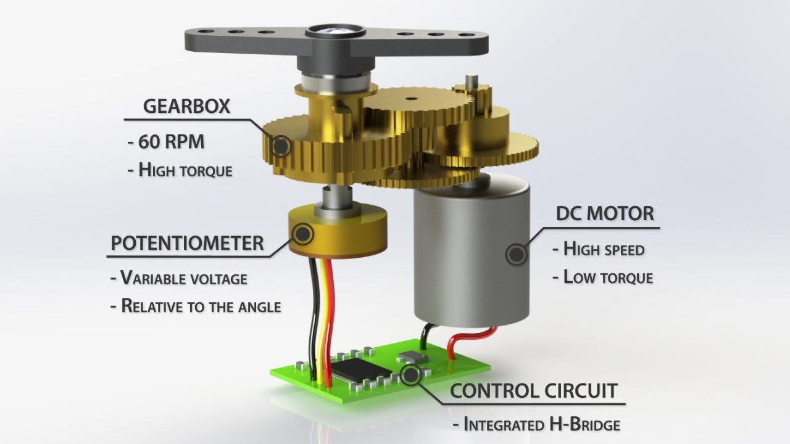

# Pertemuan 7

## Servo (Motor Servo)

<h3><b>Definisi</b></h3>
<blockquote>Motor servo merupakan motor listrik dengan sistem closed loop yang digunakan untuk mengendalikan kecepatan, akselerasi dan posisi akhir dari sebuah motor listrik dengan keakuratan yang tinggi.</blockquote>
 

 
<h3><b>Bagian-bagian (Konstruksi)</b></h3>

 

Motor servo terdiri dari tiga bagian utama, yaitu: motor, sistem kontrol dan potensiometer/encoder yang terhubung dengan satu set roda gigi ke poros output. Potentiometer atau encoder ini lah yang berfungsi sebagai sensor yang memberikan sinyal umpan balik (feedback) ke sistem kontrol apakah posisi targetnya sudah benar atau belum. Encoder biasanya digunakan pada motor servo industri. Sedangkan potentiometer biasanya digunakan pada aplikasi yang lebih sederhana seperti mobil remote kontrol.

Potentiometer ini terdiri dari tiga kabel dengan 2 kabel untuk power dan 1 kabel untuk kabel sinyal. Motor akan menggerakkan roda gigi untuk memutar potensiometer dan poros output secara bersamaan. Potensiometer lah yang akan mengendalikan posisi sudut motor servo dengan pemberian sinyal ke dalam sistem kontrol.  Jika posisi targetnya sudah benar, maka ia akan menghentikan motor servo. Sebaliknya, Jika sistem kontrol mendeteksi bahwa sudut belum tepat, maka ia akan mengubah motor servo ke arah yang benar sampai posisi sudutnya benar. Kelebihan inilah yang tidak ditemukan pada motor biasa. Motor servo biasanya digunakan untuk mengendalikan posisi sudut antara 0 dan 180 derajat.

 
<h3><b>Cara Kerja</b></h3>

Motor servo dikendalikan dengan sinyal PWM dari encoder/potentiometer. Lebar sinyal (pulsa) yang diberikan inilah yang akan menentukan posisi sudut putaran dari poros motor servo. Sebagai contoh, lebar sinyal dengan waktu 1,5 ms (mili second) akan memutar poros motor servo ke posisi sudut 90⁰. Bila sinyal lebih pendek dari 1,5 ms maka akan berputar ke arah posisi 0⁰ atau ke kiri (berlawanan dengan arah jarum jam), sedangkan bila sinyal yang diberikan lebih lama dari 1,5 ms maka poros motor servo akan berputar ke arah posisi 180⁰ atau ke kanan (searah jarum jam).

 

Ketika sinyal PWM telah diberikan, maka poros motor servo akan bergerak ke posisi yang telah ditargetkan dan berhenti pada posisi tersebut serta akan tetap bertahan pada posisi tersebut. Jika ada kekuatan eksternal yang mencoba memutar atau mengubah posisi tersebut, maka sistem closed loop dari motor servo tersebut akan bekerja dengan mencoba menahan atau melawan kekuatan eksternal tersebut dengan kekuatan internal dari motor servo itu sendiri. Namun motor servo tidak akan mempertahankan posisinya untuk selamanya, sinyal PWM harus diulang setiap 20 ms (mili second)  agar posisi poros motor servo tetap bertahan pada posisinya. Berikut ini adalah ilustrasi dari perbedaan open loop system vs closed loop system dimana motor servo mengandalkan closed loop system dengan sinyal umpan balik (feedback) sehingga posisi yang ditargetkan akan tergapai secara otomatis

<fieldset>
	<legend>Video Animasi Penjelasan Servo</legend>
	<a href="https://youtu.be/ditS0a28Sko">Lihat Disini</a>
</fieldset>
 
<h3><b>Jenis-jenis motor servo</b></h3>

Berdasarkan arus yang digunakan, motor servo terdiri dari 2 jenis yaitu :

<ol>
	<li>Motor Servo AC</li>
	
Jenis ini menggunakan arus input Alternating Current yang memiliki kemampuan daya yang tinggi. Motor ini pada umumnya memiliki ukuran yang besar dan tentunya torsi yang tinggi. Penggunaan Servo AC banyak ditemui pada perangkat industri skala besar.

	<li>Motor Servo DC</li>
	
Motor ini memiliki ukuran dan torsi yang lebih kecil apabila dibandingkan dengan Servo AC. Karena menggunakan arus DC, maka input daya dapat berasal dari Adaptor maupun baterai. Penggunaan motor ini banyak dijumpai pada rangkaian lengan robot dan otomasi skala kecil.

</ol>

Berdasarkan putarannya, motor servo terdiri dari 3 jenis yaitu :

<ol>
	<li>Positional rotation</li>
	
Motor jenis ini hanya memiliki sudut putaran 180° yang dapat diatur searah maupun berlawanan jarum jam. Istilah searah jarum jam disebut juga CW (Clock wise) dan berlawanan jarum jam disebut CCW (Counter clock wise). Motor ini dilengkapi dengan mekanisme gearbox untuk mencegah sudut putaran yang melewati batas dan melindungi sensor putaran (potensiometer). Pada penggunaannya, motor ini kerap dijumpai pada rangkaian lengan robot, baik pada bagian sendi maupun grippernya.

	<li>Continuous Rotation</li>
	
Berbeda dengan positional rotation, jenis ini dapat diatur sudut putarannya hingga 360°. Artinya, motor ini dapat diatur untuk berputar secara kontinyu layaknya motor DC biasa, namun dengan torsi yang tinggi. Motor ini juga dapat bergerak searah maupun berlawanan arah jarum jam. Untuk membedakan motor ini dengan positional rotation, tidak bisa dengan hanya melihat bodinya saja., melainkan melalui datasheet yang berasal dari tipe yang tertera pada bodi motor. 

	<li>Linear Rotation</li>
	
Motor ini mirip seperti positional rotation, namun dengan mekanisme gear yang berbeda. Pada Linear Rotation, gearbox tidak bergerak memutar, melainkan maju-mundur atau sebaliknya. Gearbox pada jenis ini ditambahkan mekanisme rack and pinion, sehingga memungkinkan gerakan tersebut. Motor ini jarang ditemukan karena peruntukannya pada skala industri tertentu. 

</ol>
 
<h3><b>Kekurangan dan Kelebihan</b></h3>

Kelebihan: 

<ul>
	<li>Akurasi tinggi</li>
	<li>Motor servo tidak bergetar dan beresonasi saat beroperasi.</li>
	<li>Efisiensi Tinggi</li>
	<li>Rasio Torsi terhadap inersia tinggi</li>
	<li>Tidak bising meskipun pada Rpm tinggi</li>
	<li>Fleksibel</li>
	<li>Mudah dikontrol dan di-program melalui output digital</li>
</ul>

Kekurangan

<ul>
	<li>Biaya mahal</li>
</ul>
<h3><b>Contoh Penerapannya</b></h3>
 

 
<ul>
	<li>Bidang robotika terutama pada sendi dan penjepit (gripper) lengan robot</li>
	<li>Kamera tracking</li>
	<li>Solar panel  tracking</li>
	<li>Printer dan DVD player</li>
	<li>Pengatur posisi antena</li>
	<li>Konveyor Belt</li>
	<li>Auto fokus kamera digital</li>
	<li>Pintu otomatis</li>
</ul>
 
<h3><b>Brand Motor Servo baik dan sering digunakan</b></h3>
<ul>
	<li>SG90s</li>
	
Servo ini dapat dikenali dengan mudah karena memiliki bodi yang berwarna biru. Gearbox pada motor ini terbuat dari plastik, sehingga harganya lebih murah. Anda akan sering melihat merk servo ini pada project elektronika dan robotika sederhana.

	<li>MG90s</li>
	
Berbeda dengan tipe SG-90, tipe ini memiliki bodi yang berwarna hitam. Motor MG-90 merupakan tipe Positional rotation, alias putarannya 180°. Gearnya pun terbuat dari logam, sehingga lebih tahan lama.

	<li>MG-995</li>
	
Tipe ini merupakan versi yang lebih tinggi dari dua tipe sebelumnya. MG-995 memiliki konstruksi yang lebih kuat dan tahan lama. Torsinya juga besar sehingga cocok digunakan untuk lengan robot dengan gerakan motorik yang berat.

	<li>RDS-3115</li>
	
Motor jenis ini banyak dipakai pada project robotika seperti pada robot spider atau humanoid robot. Uniknya, sudut putaran motor ini dapat diatur hingga 270 º.

	<li>Dynamixel Series</li>
	
Motor servo merk dynamixel adalah servo pabrikan dari Negara Korea Selatan. Servo ini memiliki teknologi paling tinggi dibanding semua type servo diatas. Dynamixel sangat terkenal karena digunakan sebagai aktuator penggerak robot spider atau Humanoid. ervo jenis ini banyak digunakan oleh tim robot yang berlomba pada ajang Kontes Robot Indonesia (KRI). Beberapa tipe yang sering digunakan diantaranya adalah AX-12, AX-18,  MX-28 dan MX64.

</ul>
 

Untuk praktik simulasinya:

<a href="#">Lihat Video Pertemuan-7 Materi ke-6</a>
 
 

Referensi:

 
<a href="https://www.insinyoer.com/cara-kerja-motor-servo/" target="_blank">www.insinyoer.com/cara-kerja-motor-servo/</a>
 
<a href="https://www.pololu.com/category/23/rc-servos" target="_blank">www.pololu.com/category/23/rc-servos</a>
 
<a href="https://www.andalanelektro.id/2021/01/mengenal-motor-servo.html" target="_blank">www.andalanelektro.id/2021/01/mengenal-motor-servo.html</a>
 
<a href="https://realpars.com/servo-motor/" target="_blank">www.realpars.com/servo-motor/</a>