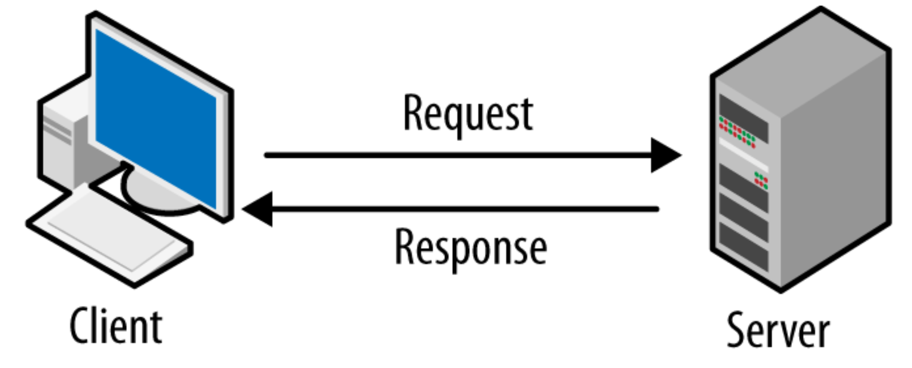
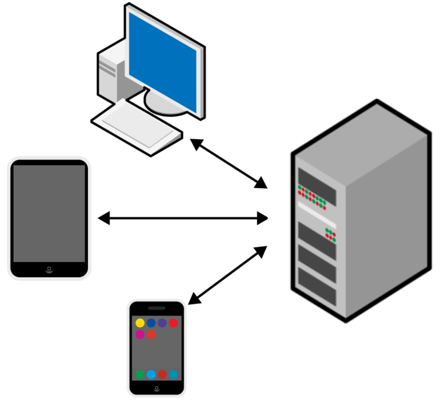

# Pertemuan 10

<h1>Server to Client</h1>

Client-server / Server-client adalah arsitektur desain perangkat lunak populer yang, pada tingkat abstrak, memecah perangkat lunak menjadi dua bagian: sisi klien dan sisi server.

<ul>
	<li>Sisi klien (atau sederhananya, klien) adalah aplikasi yang berjalan di komputer pengguna akhir; ia menyediakan antarmuka pengguna ( UI ) yang menangani apa yang dirasakan dan terlihat seperti aplikasi dan bagaimana ia berinteraksi dengan pengguna akhir. Ini dapat menggunakan dan menggunakan sumber daya pada mesin pengguna (perangkat komputasi) seperti penyimpanan sementara dan lokal, dll.</li>
	<li>Sisi server (atau sederhananya, server) adalah aplikasi yang menerima permintaan dari klien, dan berisi logika untuk mengirim data yang sesuai kembali ke klien. Alih-alih antarmuka pengguna, server biasanya memiliki antarmuka pemrograman aplikasi ( API ). Selain itu, server sering kali menyertakan database , yang akan terus menyimpan semua data untuk aplikasi tersebut.</li>
</ul>

Selama aplikasi perangkat lunak Anda mematuhi arsitektur server-klien (yaitu klien dapat mengirim dan menerima data ke API di server), Anda bebas membangun antarmuka pengguna apa pun yang Anda inginkan pada platform apa pun yang Anda inginkan. Ini menguntungkan karena aplikasi perangkat lunak modern diharapkan tersedia di berbagai platform dan memberikan pengalaman yang konsisten di seluruh perangkat.

