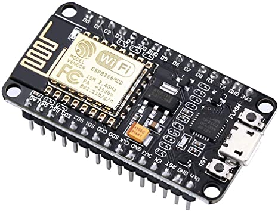
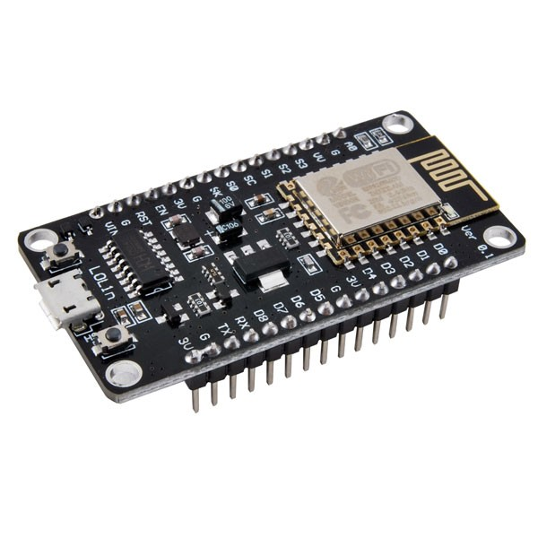
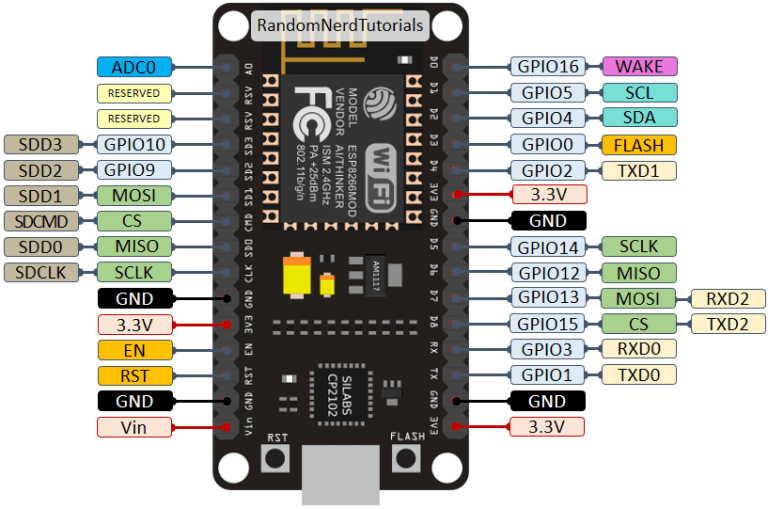

# Pertemuan 9

<h2>ESP8266 NodeMCU</h2>

<h2>ESP-12E</h2>

<blockquote><i>ESP-12E adalah modul Wi-Fi mini yang ada di pasaran dan digunakan untuk membuat koneksi jaringan nirkabel untuk mikrokontroler atau prosesor. Inti dari ESP-12E adalah ESP8266EX, yang merupakan SoC nirkabel terintegrasi tinggi (System on Chip). Ini fitur kemampuan untuk menanamkan kemampuan Wi-Fi ke sistem atau berfungsi sebagai aplikasi mandiri. Ini adalah solusi biaya rendah untuk mengembangkan aplikasi IoT.</i></blockquote>

<h3>Bentuk fisik</h3>
<figure>
	
	<figcaption>ESP-12E adalah anggota dari seri 'ESP-XX'. Meskipun semuanya didasarkan pada ESP8266 SoC, mereka berbeda dalam hal pin keluaran, memori flash, dan jenis antena. Modul-modul ini diberi nomor dari ESP-01 hingga ESP-15 dan memiliki performa dan biaya terbaik. Banyak insinyur menggunakan modul ini untuk mengatur komunikasi nirkabel antara dua aplikasi. Untuk berbagi data dan IoT, Anda akan menemukan modul ini Ideal.</figcaption>
</figure>
 

<h3>Susunan Pin ESP-12E</h3>

 

<h3>Pin fungsi</h3>
<table>
	<thead>
		<tr>
			<th>Pin</th>
			<th>Nama</th>
			<th>Deskripsi</th>
		</tr>
	</thead>
	<tbody>
		<tr>
			<td>1</td>
			<td>RST</td>
			<td>Pin reset modul</td>
		</tr>
		<tr>
			<td>2</td>
			<td>ADC</td>
			<td>Analog Input Pin for 10-bit ADC (0V to1V)</td>
		</tr>
		<tr>
			<td>3</td>
			<td>EN</td>
			<td>Module Enable Pin (Active HIGH)</td>
		</tr>
		<tr>
			<td>4</td>
			<td>GPIO 16</td>
			<td>General Purpose Input Output Pin 16</td>
		</tr>
		<tr>
			<td>5</td>
			<td>GPIO14</td>
			<td>General Purpose Input Output Pin 14</td>
		</tr>
		<tr>
			<td>6</td>
			<td>GPIO12</td>
			<td>General Purpose Input Output Pin 12</td>
		</tr>
		<tr>
			<td>7</td>
			<td>GPIO13</td>
			<td>General Purpose Input Output Pin 13</td>
		</tr>
		<tr>
			<td>8</td>
			<td>VCC</td>
			<td>+3.3V Power Input</td>
		</tr>
		<tr>
			<td>9</td>
			<td>CS0</td>
			<td>Chip selection Pin of SPI interface</td>
		</tr>
		<tr>
			<td>10</td>
			<td>MISO</td>
			<td>MISO Pin of SPI interface</td>
		</tr>
		<tr>
			<td>11</td>
			<td>GPIO 9</td>
			<td>General Purpose Input Output Pin 9</td>
		</tr>
		<tr>
			<td>12</td>
			<td>GPIO 10</td>
			<td>General Purpose Input Output Pin 10</td>
		</tr>
		<tr>
			<td>13</td>
			<td>MOSI</td>
			<td>MOSI Pin of SPI interface</td>
		</tr>
		<tr>
			<td>14</td>
			<td>SCLK</td>
			<td>Clock Pin of SPI interface</td>
		</tr>
		<tr>
			<td>15</td>
			<td>GND</td>
			<td>Ground pin</td>
		</tr>
		<tr>
			<td>16</td>
			<td>GPIO 15</td>
			<td>General Purpose Input Output Pin 15</td>
		</tr>
		<tr>
			<td>17</td>
			<td>GPIO 2</td>
			<td>General Purpose Input Output Pin 2</td>
		</tr>
		<tr>
			<td>18</td>
			<td>GPIO 0</td>
			<td>General Purpose Input Output Pin  0</td>
		</tr>
		<tr>
			<td>19</td>
			<td>GPIO 4</td>
			<td>General Purpose Input Output Pin  4</td>
		</tr>
		<tr>
			<td>20</td>
			<td>GPIO 5</td>
			<td>General Purpose Input Output Pin  5</td>
		</tr>
		<tr>
			<td>21</td>
			<td>RXD0</td>
			<td>UART0 RXD Pin</td>
		</tr>
		<tr>
			<td>22</td>
			<td>TXD0</td>
			<td>UART0 RXD Pin</td>
		</tr>
	</tbody>
</table>

<h3>Pengaplikasian</h3>
<ul>
	<li>Weather station</li>
	<li>IoT applications</li>
	<li>Home appliances</li>
	<li>Toys and Gaming applications</li>
	<li>Wireless control systems</li>
	<li>Home automation</li>
	<li>Security ID tags</li>
</ul>

<h2>NodeMCU</h2>

<blockquote><i>NodeMCU (Node MicroController Unit) adalah lingkungan pengembangan perangkat lunak dan perangkat keras open-source yang dibangun di sekitar System-on-a-Chip (SoC) murah yang disebut ESP8266. ESP8266, dirancang dan diproduksi oleh Espressif Systems, berisi elemen penting komputer: CPU, RAM, jaringan (WiFi), dan bahkan sistem operasi modern dan SDK. Itu menjadikannya pilihan yang sangat baik untuk semua jenis proyek Internet of Things (IoT).</i></blockquote>

<h3>NodeMCU Model</h3>

NodeMCU tersedia dalam berbagai model paket. Umum untuk semua desain adalah inti ESP8266 dasar. Desain berdasarkan arsitektur telah mempertahankan tata letak standar 30-pin. Beberapa desain menggunakan tapak sempit (0,9″) yang lebih umum, sementara yang lain menggunakan tapak lebar (1,1″) – pertimbangan penting yang harus diperhatikan.

The most common models of the NodeMCU are the Amica (based on the standard narrow pin-spacing) and the LoLin which has the wider pin spacing and larger board. The open-source design of the base ESP8266 enables the market to design new variants of the NodeMCU continually.

<figure>
	
	<figcaption>Amica NodeMCU berukuran 49mm x 26mm dengan ruang pin standar 0,1″ antar pin dan 0,9″ antar baris. Amica NodeMCU berukuran sekitar 25% lebih kecil daripada NodeMCU model LoLin yang sangat kompatibel</figcaption> 
</figure>
<figure>
	
	<figcaption>NodeMCU gaya LoLin berukuran 58mm x 32mm dengan jarak pin 0,1″ antar pin dan 1,1″ antar baris</figcaption>
</figure>

<h3>NodeMCU teknikal spesifikasi</h3>
<table>
	<thead>
		<tr>
			<th>Kriteria</th>
			<th>Official (Amica) NodeMCU</th>
			<th>LoLin NodeMCU</th>
		</tr>
	</thead>
	<tbody>
		<tr>
			<td>Microcontroller</td>
			<td>ESP-8266 32 bit</td>
			<td>ESP-8266 32 bit</td>
		</tr>
		<tr>
			<td>NodeMCU Model</td>
			<td>Amica</td>
			<td>Clone LoLin</td>
		</tr>
		<tr>
			<td>Dimensi NodeMCU</td>
			<td>49mm x 26mm</td>
			<td>58mm x 32mm</td>
		</tr>
		<tr>
			<td>Jarak pin</td>
			<td>0.9"(22.86mm)</td>
			<td>1.1"(27.94mm)</td>
		</tr>
		<tr>
			<td>Clock speed</td>
			<td>80 MHz</td>
			<td>80 MHz</td>
		</tr>
		<tr>
			<td>USB ke serial</td>
			<td>CP2102</td>
			<td>CH340G</td>
		</tr>
		<tr>
			<td>Konektor USB</td>
			<td>Micro USB</td>
			<td>Micro USB</td>
		</tr>
		<tr>
			<td>Voltase operasi</td>
			<td>3.3V</td>
			<td>3.3V</td>
		</tr>
		<tr>
			<td>Input voltase</td>
			<td>4.5V - 10V</td>
			<td>4.5V - 10V</td>
		</tr>
		<tr>
			<td>Flash Memory/SRAM</td>
			<td>4MB/64KB</td>
			<td>4MB/64KB</td>
		</tr>
		<tr>
			<td>Digital IO pin</td>
			<td>11</td>
			<td>11</td>
		</tr>
		<tr>
			<td>Analog IO pin</td>
			<td>1</td>
			<td>1</td>
		</tr>
		<tr>
			<td>ADC Range</td>
			<td>0 - 3.3V</td>
			<td>0 - 3.3V</td>
		</tr>
		<tr>
			<td>UART/SPI/12c</td>
			<td>1/1/1</td>
			<td>1/1/1</td>
		</tr>
		<tr>
			<td>WiFi Built in</td>
			<td>802.11 b/g/n</td>
			<td>802.11 b/g/n</td>
		</tr>
		<tr>
			<td>Temperatur</td>
			<td>-40C - 125C</td>
			<td>-40C - 125C</td>
		</tr>
	</tbody>
</table>

<h3>PinOut dan fungsi</h3>
<figure>
	
	<figcaption>ESP8266 model Amica, dengan ESP-12e ditanamkan. Berikut adalah pin-pinnnya</figcaption>
</figure>

Berikut adalah fungsi-fungsi dari pinnya

<ul>
	<li>vin</li>
	
Dapat digunakan untuk langsung mensuplai NodeMCU/ESP8266 dan periferalnya. Daya yang dikirimkan pada VIN diatur melalui regulator onboard pada modul NodeMCU – Anda juga dapat memasok 5V yang diatur ke pin VIN

	<li>3.3V</li>
	
Pin adalah output dari pengatur tegangan onboard dan dapat digunakan untuk memasok daya ke komponen eksternal.

	<li>G / GND</li>
	
Pin ground dari ESP8266/NodeMCU

	<li>SCL dan SDA</li>
	
SCL dan SDA adalah I2C pin. Digunakan untuk menghubungkan sensor dan periferal I2C. I2C Master dan I2C Slave keduanya didukung. Fungsionalitas antarmuka I2C dapat direalisasikan secara terprogram, dan frekuensi clock maksimum adalah 100 kHz. Perlu dicatat bahwa frekuensi clock I2C harus lebih tinggi daripada frekuensi clock paling lambat dari perangkat slave.

	<li>GPIO</li>
	
NodeMCU/ESP8266 memiliki 17 pin GPIO yang dapat ditetapkan untuk fungsi seperti I2C, I2S, UART, PWM, IR Remote Control, Lampu LED dan Tombol secara terprogram. Setiap GPIO yang diaktifkan secara digital dapat dikonfigurasi ke pull-up atau pull-down internal, atau diatur ke impedansi tinggi. Ketika dikonfigurasi sebagai input, ini juga dapat diatur ke edge-trigger atau level-trigger untuk menghasilkan interupsi CPU.

	<li>ADC0 / ADC Channel</li>
	
NodeMCU tertanam dengan SAR ADC presisi 10-bit. Kedua fungsi tersebut dapat diimplementasikan menggunakan ADC. Pengujian tegangan catu daya pin VDD3P3 dan pengujian tegangan input pin TOUT. Namun, penerapannya tidak dapat dilakukan secara bersamaan.

	<li>RXD0, TXD0, TXD1, RXD2, dan TXD2</li>
	
NodeMCU/ESP8266 memiliki 2 antarmuka UART (UART0 dan UART1) yang menyediakan komunikasi asinkron (RS232 dan RS485), dan dapat berkomunikasi hingga 4,5 Mbps. UART0 (TXD0, RXD0, RST0 & CTS0) dapat digunakan untuk komunikasi. Namun, UART1 (TXD1 pin) hanya menampilkan sinyal transmisi data sehingga biasanya digunakan untuk mencetak log.

	<li>SCLK, MISO, MOSI, CS</li>
	
NodeMCU/ESP8266 memiliki dua SPI (SPI dan HPI) dalam mode slave dan master. SPI ini juga mendukung fitur SPI tujuan umum berikut:
		1. 4 mode waktu transfer format SPI
		2. Hingga 80 MHz dan jam terbagi 80 MHz
		3. FIFO hingga 64-Byte

	<li>SDIO</li>
	
NodeMCU/ESP8266 memiliki fitur Secure Digital Input/Output Interface (SDIO) yang digunakan untuk antarmuka langsung kartu SD. 4-bit 25 MHz SDIO v1.1 dan 4-bit 50 MHz SDIO v2.0 didukung.

	<li>PWIM pin</li>
	
Papan memiliki 4 saluran Pulse Width Modulation (PWM). Output PWM dapat diimplementasikan secara terprogram dan digunakan untuk menggerakkan motor digital dan LED. Rentang frekuensi PWM dapat disesuaikan dari 1000 s hingga 10000 s (100 Hz dan 1 kHz).

	<li>Kontrol pin</li>
	
digunakan untuk mengontrol NodeMCU/ESP8266. Pin-pin ini termasuk pin Chip Enable (EN), pin Reset (RST) dan pin WAKE.
		1. EN: Chip ESP8266 diaktifkan ketika pin EN ditarik TINGGI. Ketika ditarik RENDAH chip bekerja pada daya minimum.
		2. RST: Pin RST digunakan untuk mereset chip ESP8266.
		3. WAKE: Wake pin digunakan untuk membangunkan chip dari deep-sleep.

</ul>

<h2>Referensi</h2>

<ol>
	<li><a href="https://www.esp8266.com/wiki/doku.php?id=start">Espressif Official site</a></li>
	<li><a href="https://www.make-it.ca/nodemcu-details-specifications/">Spesifikasi detail NodeMCU</a></li>
	<li><a href="https://components101.com/wireless/esp12e-pinout-datasheet">ESP8266 datasheet komponen</a></li>
	<li><a href="https://randomnerdtutorials.com/esp8266-pinout-reference-gpios/">NodeMCU pinOut</a></li>
</ol>

