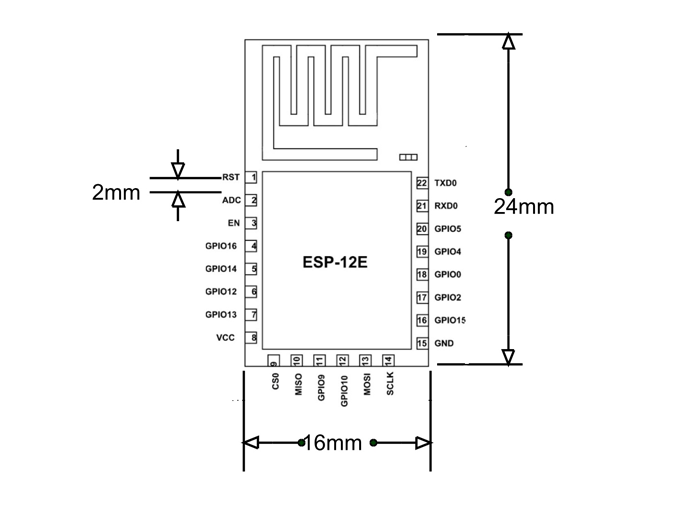

# Pertemuan 9

### ESP8266 NodeMCU

### ESP-12E

<blockquote><i>ESP-12E adalah modul Wi-Fi mini yang ada di pasaran dan digunakan untuk membuat koneksi jaringan nirkabel untuk mikrokontroler atau prosesor. Inti dari ESP-12E adalah ESP8266EX, yang merupakan SoC nirkabel terintegrasi tinggi (System on Chip). Ini fitur kemampuan untuk menanamkan kemampuan Wi-Fi ke sistem atau berfungsi sebagai aplikasi mandiri. Ini adalah solusi biaya rendah untuk mengembangkan aplikasi IoT.</i></blockquote>

<h2>Bentuk fisik</h2>
<figure>
	
	<figcaption>ESP-12E adalah anggota dari seri 'ESP-XX'. Meskipun semuanya didasarkan pada ESP8266 SoC, mereka berbeda dalam hal pin keluaran, memori flash, dan jenis antena. Modul-modul ini diberi nomor dari ESP-01 hingga ESP-15 dan memiliki performa dan biaya terbaik. Banyak insinyur menggunakan modul ini untuk mengatur komunikasi nirkabel antara dua aplikasi. Untuk berbagi data dan IoT, Anda akan menemukan modul ini Ideal.</figcaption>
</figure>
 

<h2>Susunan Pin ESP-12E</h2>

 

<h2>Pin fungsi</h2>
<table>
	<thead>
		<tr>
			<th>Pin</th>
			<th>Nama</th>
			<th>Deskripsi</th>
		</tr>
	</thead>
	<tbody>
		<tr>
			<td>1</td>
			<td>RST</td>
			<td>Pin reset modul</td>
		</tr>
		<tr>
			<td>2</td>
			<td>ADC</td>
			<td>Analog Input Pin for 10-bit ADC (0V to1V)</td>
		</tr>
		<tr>
			<td>3</td>
			<td>EN</td>
			<td>Module Enable Pin (Active HIGH)</td>
		</tr>
		<tr>
			<td>4</td>
			<td>GPIO 16</td>
			<td>General Purpose Input Output Pin 16</td>
		</tr>
		<tr>
			<td>5</td>
			<td>GPIO14</td>
			<td>General Purpose Input Output Pin 14</td>
		</tr>
		<tr>
			<td>6</td>
			<td>GPIO12</td>
			<td>General Purpose Input Output Pin 12</td>
		</tr>
		<tr>
			<td>7</td>
			<td>GPIO13</td>
			<td>General Purpose Input Output Pin 13</td>
		</tr>
		<tr>
			<td>8</td>
			<td>VDD</td>
			<td>+3.3V Power Input</td>
		</tr>
		<tr>
			<td>9</td>
			<td>CS0</td>
			<td>Chip selection Pin of SPI interface</td>
		</tr>
		<tr>
			<td>10</td>
			<td>MISO</td>
			<td>MISO Pin of SPI interface</td>
		</tr>
		<tr>
			<td>11</td>
			<td>GPIO 9</td>
			<td>General Purpose Input Output Pin 9</td>
		</tr>
		<tr>
			<td>12</td>
			<td>GPIO 10</td>
			<td>General Purpose Input Output Pin 10</td>
		</tr>
		<tr>
			<td>13</td>
			<td>MOSI</td>
			<td>MOSI Pin of SPI interface</td>
		</tr>
		<tr>
			<td>14</td>
			<td>SCLK</td>
			<td>Clock Pin of SPI interface</td>
		</tr>
		<tr>
			<td>15</td>
			<td>GND</td>
			<td>Ground pin</td>
		</tr>
		<tr>
			<td>16</td>
			<td>GPIO 15</td>
			<td>General Purpose Input Output Pin 15</td>
		</tr>
		<tr>
			<td>17</td>
			<td>GPIO 2</td>
			<td>General Purpose Input Output Pin 2</td>
		</tr>
		<tr>
			<td>18</td>
			<td>GPIO 0</td>
			<td>General Purpose Input Output Pin  0</td>
		</tr>
		<tr>
			<td>19</td>
			<td>GPIO 4</td>
			<td>General Purpose Input Output Pin  4</td>
		</tr>
		<tr>
			<td>20</td>
			<td>GPIO 5</td>
			<td>General Purpose Input Output Pin  5</td>
		</tr>
		<tr>
			<td>21</td>
			<td>RXD0</td>
			<td>UART0 RXD Pin</td>
		</tr>
		<tr>
			<td>22</td>
			<td>TXD0</td>
			<td>UART0 RXD Pin</td>
		</tr>
	</tbody>
</table>

### NodeMCU

### Referensi

<ol>
	<li><a href="https://www.esp8266.com/wiki/doku.php?id=start">Espressif Official site</a></li>
	<li><a href="https://www.make-it.ca/nodemcu-details-specifications/">Spesifikasi detail NodeMCU</a></li>
	<li><a href="https://components101.com/wireless/esp12e-pinout-datasheet">ESP8266 datasheet komponen</a></li>
	<li><a href="https://randomnerdtutorials.com/esp8266-pinout-reference-gpios/">NodeMCU pinOut</a></li>
</ol>

