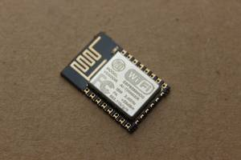

# Pertemuan 9

### ESP8266 NodeMCU

### ESP-12E

<blockquote><i>ESP-12E adalah modul Wi-Fi mini yang ada di pasaran dan digunakan untuk membuat koneksi jaringan nirkabel untuk mikrokontroler atau prosesor. Inti dari ESP-12E adalah ESP8266EX, yang merupakan SoC nirkabel terintegrasi tinggi (System on Chip). Ini fitur kemampuan untuk menanamkan kemampuan Wi-Fi ke sistem atau berfungsi sebagai aplikasi mandiri. Ini adalah solusi biaya rendah untuk mengembangkan aplikasi IoT.</i></blockquote>

<h2>Bentuk fisik</h2>
<figure>
	
	<figcaption>ESP-12E adalah anggota dari seri 'ESP-XX'. Meskipun semuanya didasarkan pada ESP8266 SoC, mereka berbeda dalam hal pin keluaran, memori flash, dan jenis antena. Modul-modul ini diberi nomor dari ESP-01 hingga ESP-15 dan memiliki performa dan biaya terbaik. Banyak insinyur menggunakan modul ini untuk mengatur komunikasi nirkabel antara dua aplikasi. Untuk berbagi data dan IoT, Anda akan menemukan modul ini Ideal.</figcaption>
</figure>
 

<h2>Susunan Pin ESP-12E</h2>

 

<h2>Pin fungsi</h2>
<table>
	<thead>
		<th>
			<td>Pin</td>
			<td>Nama</td>
			<td>Deskripsi</td>
		</th>
	</thead>
	<tbody>
		<tr>
			<td>1</td>
			<td>RST</td>
			<td>Pin reset modul</td>
		</tr>
		<tr>
			<td>2</td>
			<td>ADC</td>
			<td>Analog Input Pin for 10-bit ADC (0V to1V)</td>
		</tr>
	</tbody>
</table>

### NodeMCU

